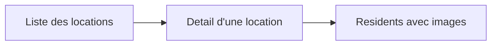
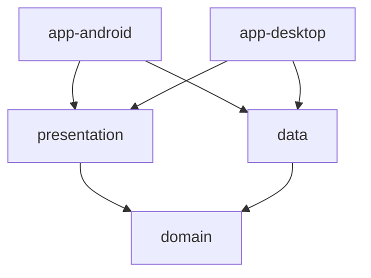
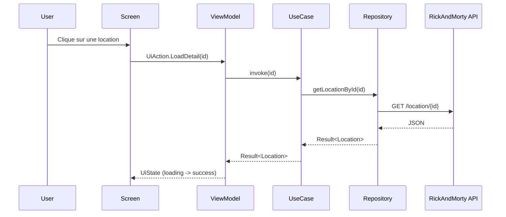
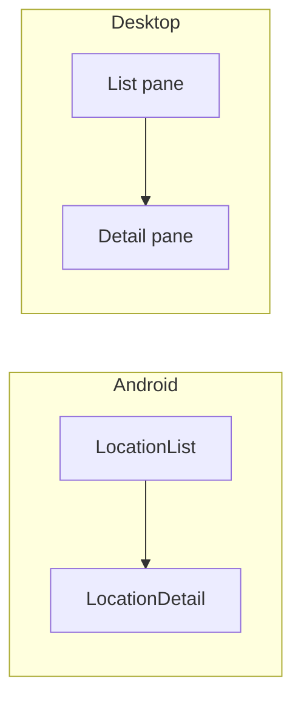

# Rick and Morty Locations

Application multiplateforme (Android + Desktop) qui permet d'explorer les locations de l'univers Rick and Morty.

## Checklist de lecture

- [x] Comprendre le projet sans jargon technique
- [x] Comprendre l'architecture technique
- [x] Voir le flux de navigation et de donnees avec des diagrammes
- [x] Savoir lancer l'application sur Android et Desktop

## Explication simple (non technique)

`Rick and Morty Locations` est une application qui affiche les lieux de la serie Rick and Morty.

Concretement, l'utilisateur peut:

- voir une liste de locations (ex: Earth C-137)
- ouvrir le detail d'une location
- consulter des informations utiles (type, dimension, date de creation)
- voir les residents associes a une location, avec leurs images

L'objectif principal du projet n'est pas d'avoir 100 features, mais d'avoir une base propre, claire et evolutive.

## Ce que voit l'utilisateur



## Explication technique

Le projet suit une architecture en couches (Clean Architecture):

- `:domain` -> regles metier et contrats
- `:data` -> appels API, cache local, mappings
- `:presentation` -> UI Compose, etats, actions, navigation
- `:app-android` -> point d'entree Android
- `:app-desktop` -> point d'entree Desktop

### Modules



Regle cle: le module `domain` ne depend d'aucun detail technique.

### Couches et responsabilites

- `domain`
  - modeles metier (`Location`, `Resident`, `LocationPage`)
  - contrats (`LocationRepository`)
  - use cases (`GetLocationsUseCase`, `GetLocationDetailUseCase`, `GetLocationResidentsUseCase`)
- `data`
  - source distante (API Rick and Morty)
  - source locale (cache en memoire)
  - mapping DTO -> modele metier
  - implementation du repository
- `presentation`
  - ecrans Compose
  - etats UI (`UiState`) et actions utilisateur (`UiAction`)
  - viewmodels (pilotage des use cases)
  - navigation mobile et adaptation desktop

### Flux de donnees



### Strategie de fetch

Le repository applique une strategie simple et robuste:

- remote-first: on essaie d'abord l'API
- fallback local: si l'API echoue, on tente le cache
- les erreurs remontent sous forme de `Result`

## Navigation

- Android: navigation en 2 ecrans (`LocationList` -> `LocationDetail`)
- Desktop: ecran unique master-detail (liste a gauche, detail a droite)



## Choix cross-platform

- code partage place en `commonMain` des modules
- code specifique plateforme reserve aux launchers (`app-android`, `app-desktop`)
- exemple d'abstraction multiplateforme: `AudioManager` (`expect/actual`)

## Stack utilisee

- Kotlin Multiplatform
- Jetpack Compose Multiplatform
- Ktor Client
- Kotlinx Serialization
- Coil (images)

## Lancer le projet

### Build complet

```powershell
Set-Location "C:\Users\PC\AndroidStudioProjects\EVAL_P3"
.\gradlew :domain:build :data:build :presentation:build :app-android:assembleDebug :app-desktop:build --no-daemon
```

### Lancer Desktop

```powershell
Set-Location "C:\Users\PC\AndroidStudioProjects\EVAL_P3"
.\gradlew :app-desktop:run
```

### Installer Android

```powershell
Set-Location "C:\Users\PC\AndroidStudioProjects\EVAL_P3"
.\gradlew :app-android:installDebug
```

## API cible

- Documentation generale: `https://rickandmortyapi.com/documentation`
- Schema location: `https://rickandmortyapi.com/documentation#location-schema`

## Vision du projet

Ce projet est pense pour etre:

- lisible (noms clairs, structure simple)
- maintenable (responsabilites separees)
- defendable (choix techniques explicites pour un contexte academique)
